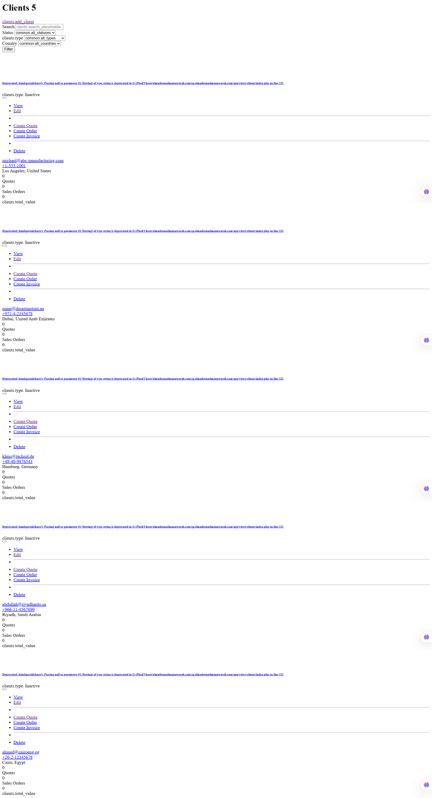
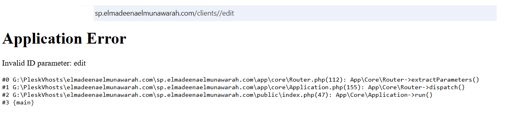

# CLIENT MANAGEMENT Screenshots

## 001.png - Client List Page

The image shows a webpage titled "Clients 5" that appears to be part of a client management system. The layout includes filters, client details, and actions. Here's a structured description:

Header Section

Title: Clients 5

A search bar with placeholder text: "Search clients…"

Dropdown filters:

Status (with options like "Common.all_statuses")

Type (with options like "Common.all_types", "clients.type.company")

Country (with options like "Common.all_countries")

A Filter button.

Error Messages

Multiple instances of warnings appear:

[Deprecated: htmlspecialchars(): Passing null to parameter #1 ($string) of type string is deprecated in G:\PleskVhosts\elmadeenaelmunawarah.com\sp.elmadeenaelmunawarah.com\app\views\clients\index.php on line 151]

These warnings are repeated before each client block.

Client Blocks

Each client entry has:

Label: clients.type: Inactive

Actions:

View

Edit

Delete

Links for:

Create Quote

Create Order

Create Invoice

Contact information (email, phone, city, country).

Stats:

Quotes

Sales Orders

Sales

clients.total_value

Examples shown:

Michael (USA) — email: michael@abc.manufcaring.com
, location Los Angeles, USA.

Omar (UAE) — email: omar@destromotor.sa
, phone UAE number, location Dubai, United Arab Emirates.

Hans (Germany) — email: hans@techdeal.de
, location Hamburg, Germany.

Abdullah (Saudi Arabia) — email: abdullah@riyadhmotor.sa
, phone Saudi number, location Riyadh, Saudi Arabia.

Ahmed (Egypt) — email: ahmed@cairocar.eg
, phone Egyptian number, location Cairo, Egypt.

Layout/Style

The page renders with minimal styling (plain text, bullet lists, and links).

It looks unformatted, possibly due to missing CSS or broken frontend rendering.

✅ Summary of Issues Noted (between brackets in text):

[Deprecated warnings from htmlspecialchars() in index.php line 151]

[Clients are labeled as "Inactive" regardless of details]

[Page is displayed without proper styling, looks like plain HTML]
---------------------------------------------------------------------------------------------------------------

## 002.png - Application Error Page

The image shows an Application Error page from the domain sp.elmadeenaelmunawarah.com.

Page Content

Header: Application Error

Message: Invalid ID parameter: edit

Traceback:

#0 G:\PleskVhosts\elmadeenaelmunawarah.com\sp.elmadeenaelmunawarah.com\app\core\Router.php(112): App\Core\Router->extractParameters()

#1 G:\PleskVhosts\elmadeenaelmunawarah.com\sp.elmadeenaelmunawarah.com\app\core\Application.php(155): App\Core\Router->dispatch()

#2 G:\PleskVhosts\elmadeenaelmunawarah.com\sp.elmadeenaelmunawarah.com\public\index.php(47): App\Core\Application->run()

#3 {main}

URL

The browser shows:
sp.elmadeenaelmunawarah.com/clients//edit

Errors Observed (in brackets)

[Invalid ID parameter: edit]

[Double slashes in the URL (/clients//edit)]

[Application error is triggered at the routing level (Router.php line 112)]
---------------------------------------------------------------------------------------------------------------
